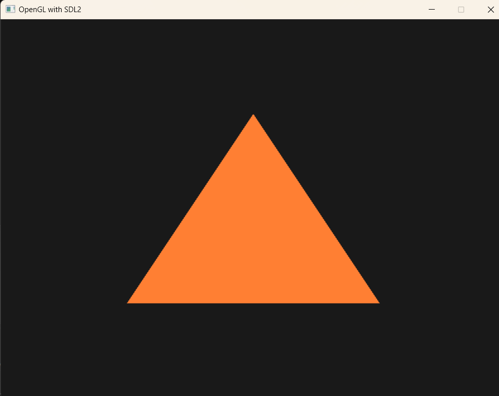

# SDLGLTriangle2024
A sample how to setup a minimal fuzz OpenGL C++ project for windows in 2024. The main components of the build system are CMake and Vcpkg.

# Usage
git clone https://github.com/mkuitune/SDLGLTriangle2024.git

git submodule update --init

cd vcpkg

./bootstrap-vcpkg.sh -useSystemBinaries

cd ..

./vcpkg/vcpkg install --triplet x64-windows

cmake -S . -B build

cmake --build build

# What it does

We install the platform specific packages in vcpkg, and point CMake to the correct vcpkg path using this line the CMakeLists.txt file:

```set(CMAKE_TOOLCHAIN_FILE "${CMAKE_SOURCE_DIR}/vcpkg/scripts/buildsystems/vcpkg.cmake")```

We have three files:
* CMakeLists.txt (this is the main CMake build definition file)
* vcpkg.json (this is used to simplify installation of packages to vcpkg)
* main.cpp

All of the code is in main.cpp. It renders a triangle, and is not good for any purpose (except proving that the build setup works). The interesting part is how to combine CMake and vcpkg in a simple manner.

# The recipe starting from scratch:

## Step 1

### Prerequisities
Install Git and Cmake and Visual Studio 2022 (Community edition is just fine). Visual Studio comes with Git and CMake so it might suffice (my setup is so messed up I can't tell, sorry).

### Already done in this repo
git init
git submodule add https://github.com/microsoft/vcpkg.git

### Stuff that needs to be done

git submodule update --init

#### posix
cd vcpkg
./bootstrap-vcpkg.sh -useSystemBinaries

#### win
cd vcpkg
bootstrap-vcpkg.bat

## Step 2
run vcpkg install (in project root):
### Windows
./vcpkg/vcpkg install --triplet x64-windows

### Linux
Haven't tested yet

## Step 3 Build
### Command line
cmake -S . -B build
cmake --build build
### Visual studio (2022 and up)
Open CMake project, point it at the CMakeLists.txt file
